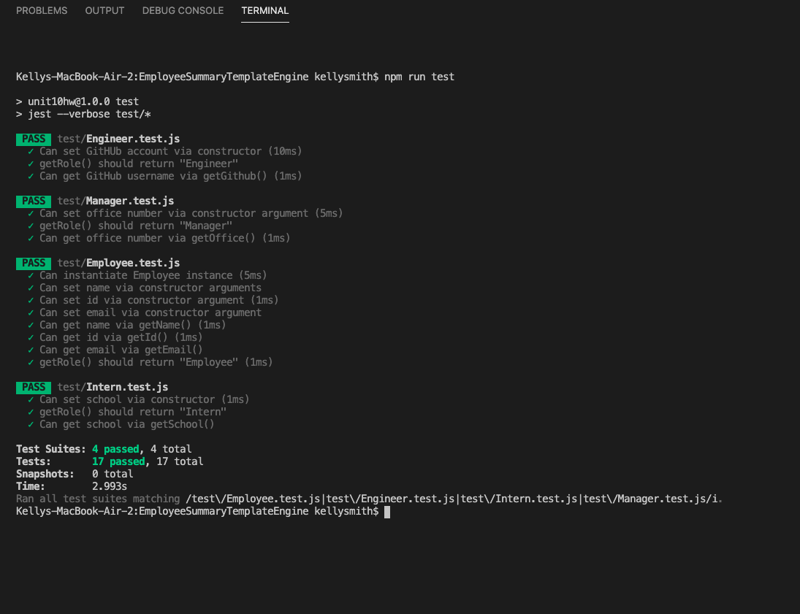
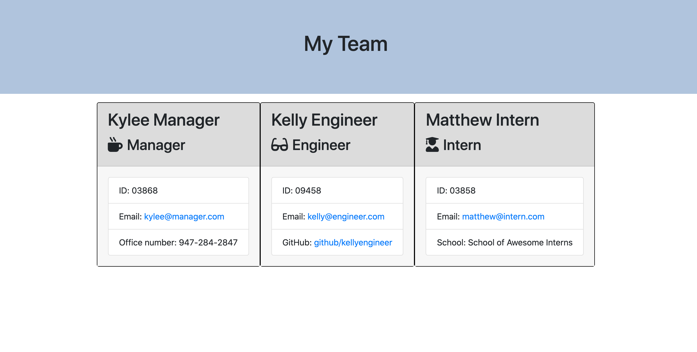
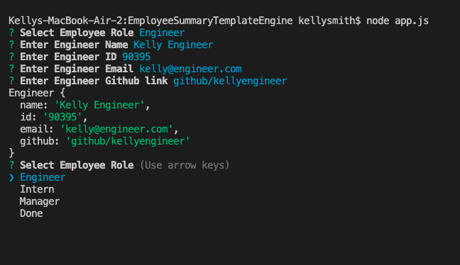

# Employee Summary Template Engine

### GitHubRepo:  https://github.com/kellys-tech/EmployeeSummaryTemplateEngine
### Video: https://youtu.be/xJV9zufJWy4

*This is an Employee Roster generator. This is used to create a roster of all employees entered. When this file is run using node.js, the user will be prompted with an option to select the role of the employee they want to to enter. When the user selects a role, they will be prompted with a list of questions to answer related to that role. When all questions are answered, the user will have the opportunity to continue adding employees or selcting Done. If the user selects done, the html will be created.*

## README Generator created using:
* HTML
* CSS
* Javascript

## Dependencies:
* Node
* NPM packages
* Jest

## How to use
* The user will run this program in their terminal by entering `node index.js`.
* The user will then be prompted to select a type of they want to enter an employee for. The options are Manager, Engineer, Intern an Done.
* If the user selects a role of Manager, Engineer or Intern, they will be prompted to enter information of the employee that are related to the role selected.
* When they user has completed entering the information for that employee, they will be asked to select another role or DONE.
* If the user selects another role, they will be prompted to enter the employee information for that role.
* If the user selects DONE, then the html will be generated and placed in the output directory.

## How to test
* The user can run the tests in their terminal by entering `npm run test`
* The tests will be run and show a pass or fail in the terminal.

## Screenshots

* see output folder for HTML created from using Generator

